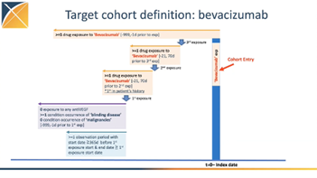

```{r setup, include=FALSE}
# library(LegendT2dm)
knitr::opts_chunk$set(echo = TRUE, warning=FALSE)
options(kableExtra.latex.load_packages = FALSE)
library(kableExtra)
library(dplyr)
options(readr.show_col_types = FALSE)
options(knitr.kable.NA = "")
options(knitr.table.format = function() {
  if (knitr::is_latex_output()) {
    "latex"
  } else if (knitr::is_html_output()) {
    "html"
  } else {
    "pipe"
  }
})
latex_table_font_size <- 8
```

# List of Abbreviations

```{r abbreviations, echo=FALSE}
abbreviations <- readr::read_delim(col_names = FALSE, delim = ":", trim_ws = TRUE, file = "
Anti-VEGF: anti-vascular endothelial growth factor 

DME: diabetic macular edema 

DR: diabetic retinopathy 

AMD: age-related macular degeneration 

VO: vein occlusion 

CKD: chronic kidney disease 

ICD: International Classification of Diseases 

CPT: Current Procedural Terminology 

OHDSI: Observational Health Data Sciences and Informatics 

OMOP: Observational Medical Outcomes Partnership 

CDM: common data model 

PS: propensity score 

EHR: electronic health record 

IRB: Institutional Review Board 

JHM: Johns Hopkins Medicine 

ARVO: The Association for Research in Vision and Ophthalmology 
")

tab <- kable(abbreviations, col.names = NULL, linesep = "", booktabs = TRUE)

if (knitr::is_latex_output()) {
  tab %>% kable_styling(latex_options = c("striped", "hold_position"), 
                        font_size = latex_table_font_size)
} else {
  tab %>% kable_styling(bootstrap_options = "striped")
}
```

\clearpage

# Responsible Parties

## Investigators

```{r parties, echo=FALSE}
parties <- readr::read_delim(col_names = TRUE, delim = ";", trim_ws = TRUE, file = "
  Investigator; Institution/Affiliation
  Cindy Cai, MD *; Wilmer Eye Institute, Johns Hopkins Hospital, Baltimore, MD, USA
")

tab <- kable(parties, booktabs = TRUE, linesep = "") %>%
  column_spec(1, width = "10em") %>%
  column_spec(2, width = "35em") %>%
  footnote(general = "* Principal Investigator", general_title = "")

if (knitr::is_latex_output()) {
  tab %>% kable_styling(latex_options = c("striped", "hold_position"),
                        font_size = latex_table_font_size)
} else {
  tab %>% kable_styling(bootstrap_options = "striped")
}
```

## Disclosures

This study is undertaken within Observational Health Data Sciences and Informatics (OHDSI), an open collaboration.

\clearpage

# Abstract

Background: The potential adverse kidney effects of the commonly used intravitreal anti-vascular endothelial growth factor (anti-VEGF) medications are poorly understood. 

Purpose: To estimate the risk of kidney failure after intravitreal anti-VEGF medications across the Observational Health Data Sciences and Informatics (OHDSI) network, comparing ranibizumab, aflibercept, and bevacizumab. 

Design: Retrospective comparative cohort analysis of administrative claims and electronic health record (EHR) data in the OHDSI network. 

Subjects: Patients with blinding diseases including diabetic macular edema (DME), diabetic retinopathy (DR), age-related macular degeneration (AMD), and vein occlusion (VO) who receive ≥3 monthly anti-VEGF will be included. Patients with pre-existing kidney failure will be excluded. 

Methods: Patients receiving ranibizumab will be compared to propensity score matched patients receiving aflibercept, and patients receiving bevacizumab. We will deploy the large-scale propensity score method that adjust for a comprehensive range of baseline characteristics. Cox models will be used to compare the time to kidney failure between patients who receive ranibizumab with patients who receive aflibercept, ranibizumab with bevacizumab, and bevacizumab with aflibercept. 

Conclusions: Knowing the relative risk for kidney failure between the three commonly used anti-VEGF medications will allow ophthalmologists to select safer treatments.


\clearpage

# Amendments and Updates

```{r amendments, echo=FALSE}
amendments <- readr::read_delim(col_names = TRUE, delim = ";", trim_ws = TRUE, file = "
  Number; Date; Section of study protocol; Amendment or update; Reason
")

tab <- kable(amendments, booktabs = TRUE, linesep = "")

if (knitr::is_latex_output()) {
  tab %>% kable_styling(latex_options = c("striped", "hold_position"), font_size = latex_table_font_size)
} else {
  tab %>% kable_styling(bootstrap_options = "striped")
}
```

# Milestones

```{r dates, echo=FALSE}
dates <- readr::read_delim(col_names = TRUE, delim = ";", trim_ws = TRUE, file = "
•	Identify data partners
•	Data partners to share data diagnostics results
•	Complete candidate phenotypes
•	Data partners to share phenotype diagnostics results
•	Finalize analytic package
•	Data partners to run analytic package
•	Data partners to share study diagnostic results
•	Finalize results from data partners
•	Manuscript drafting and writing
•	Submit abstract: OHDSI Global Symposium (May 2023), ARVO (Jan 2024)
")

tab <- kable(dates, booktabs = TRUE, linesep = "")

if (knitr::is_latex_output()) {
  tab %>% kable_styling(latex_options = c("striped", "hold_position"), font_size = latex_table_font_size)
} else {
  tab %>% kable_styling(bootstrap_options = "striped")
}
```

# Rationale and Background

Intravitreal anti-vascular endothelial growth factor (anti-VEGF) medications have revolutionized the treatment of blinding diseases.​1,2​ Nearly 20 million intravitreal injections were given globally in 2016 to treat conditions such as diabetic macular edema (DME), diabetic retinopathy (DR), age-related macular degeneration (AMD), and vein occlusion (VO).​1​ When given systemically, anti-VEGF medications have adverse kidney effects (e.g., proteinuria, acute kidney injury).​3–5​ Patients at high risk for chronic kidney disease (CKD), for example, those ≥60 years and those with diabetes, may be  more likely harmed by the adverse kidney effects of intravitreal anti-VEGF.​6​ CKD can progress to kidney failure, or end stage kidney disease, which is a major source of morbidity and mortality and is a financial burden to society.​6,7​ 

 

When anti-VEGF medications are given intravitreally, there is systemic absorption of the drug that is greatest with bevacizumab and aflibercept and lowest with ranibizumab.​8,9​ However, evidence about the subsequent kidney effect is conflicting. Several case reports document kidney damage after intravitreal anti-VEGF.​10–12​ On the other hand, retrospective cohort studies have not identified treatment-associated declines in kidney function, or estimated glomerular filtration rate (eGFR).​13,14​ A secondary analysis from a randomized trial also did not show differences in rates of kidney damage.​15​ However, these studies were limited to a single institution, had small sample sizes (<600 patients), only included patients without CKD, or did not evaluate the severe phenotype of kidney failure. To resolve this controversy, a comprehensive study is needed to evaluate the kidney effects of intravitreal anti-VEGF. In populations at high risk for CKD, the treating ophthalmologist can choose alternate forms of therapy (e.g., focal laser for DME), or the intravitreal anti-VEGF with the least systemic absorption (e.g., ranibizumab).​16–18​ 


# Study Objectives

The overall objective of the study is to estimate the comparative risk of kidney failure associated with intravitreal anti-VEGF exposure in patients with blinding diseases. The rationale is that knowing the comparative risk for kidney failure among the three commonly used anti-VEGF medications will allow the ophthalmologist to select the safest treatments, particularly for populations at high risk for adverse kidney effects. To address our hypothesis, we propose the following questions. 

1. Amongst people with blinding diseases (DR/DME, AMD, and VO), does exposure to aflibercept increase the risk of kidney failure, relative to ranibizumab? 

2. Amongst people with blinding diseases (DR/DME, AMD, and VO), does exposure to bevavizumab increase the risk of kidney failure, relative to ranibizumab? 

3. Amongst people with blinding diseases (DR/DME, AMD, and VO), does exposure to bevacizumab increase the risk of kidney failure, relative to aflibercept? 

# Research Methods

## Study Design/Data Sources

This will be a retrospective cohort study of patients with blinding diseases (DR/DME, AMD, and VO) comparing the risk of kidney failure after exposure to aflibercept relative to ranibizumab, bevacizumab to ranibizumab, and bevacizumab to aflibercept. Data sources will be administrative claims or electronic health record (EHR) data across the OHDSI network. 

## Study Population

Patients ≥18 years who have received ≥3 monthly intravitreal anti-VEGF injections with ranibizumab, aflibercept, or bevacizumab with a diagnosis of DME/DR, AMD, and VO with at least 365 days of prior observation will be included in the study.​16,17,19–22​ Cohort entry will begin with the third anti-VEGF medication. Patients with pre-existing kidney failure will be excluded. Patients with pre-existing diagnosis of malignancies will be excluded. (Figure 1) Patients will exit the cohort if they switch to another anti-VEGF medication (e.g., bevacizumab to ranibizumab).

Figure 1: Exposure cohort definition using bevacizumab as the example.


## Exposure Comparators
The exposure is receipt of ≥3 monthly intravitreal anti-VEGF medications (whether ranibizumab, aflibercept, or bevacizumab).  

## Outcomes {#outcomes}
The outcome is time from the third anti-VEGF to kidney failure, as defined by previously validated OMOP phenotypes, during the observation window after cohort entry.​23,24​ 

## Covariates
We will deploy the large-scale propensity score method that adjust for a comprehensive range of baseline characteristics.​25​ 

## Negative controls

Negative controls will be picked to represent exposure-outcome pairs where no causal effect is expected to exist.

# Data Analysis Plan

## General

Although the primary aim of this study is a comparative safety study, various standardized analytics available in the OHDSI community will be applied. The Strategus pipeline will be used to call various packages in the HADES library for A) data characterization (A1-cohort diagnostics, A2-cohort features, A3-incidence rates, A4-time-to-event), B) patient-level prediction, and C) population-level effect estimation (C1-comparative cohort, C2-self-controlled case-series).​26,27​ 

## A) Data Characterization

### A1) Cohort Diagnostics

The R package CohortDiagnostics will be executed for all target, comparator, indication, and outcome cohorts to evaluate measurement error in the phenotype development and evaluation process.​28​ 

### A2) Cohort Features

The Characterization and FeatureExtraction packages in HADES will be used to identify features of patients in each exposure group who had the outcome and those who did not have the outcome.​27​ Features will be extracted from the 365 day observation prior to cohort entry and will include variables such as demographic data (sex, age group, race, ethnicity), prior conditions/drug exposures/procedures/measurements/devices/observations, and risk scors (e.g., Charlson comorbidity index, DCSI, CHADS2VASC score).

### A3) Incidence Rates

The Characterization package in HADES will be used to calculate the incidence rates of the outcome for each exposure cohort and indication cohort. The rate is calculated as the number of outcomes during the time-at-risk divided by the number of total person days. 

#### Calculation of time-at risk
The time-at-risk for patients who undergo anti-VEGF starts after the third anti-VEGF injection until the end of the continuous drug exposure, defined as a gap in exposure of >180 days, end of continuous observation period, or study period. Anti-VEGF need typically decreases over time; however, some patients require lifelong VEGF suppression and the proportion of patients who require lifelong VEGF is likely different depending on the disease indication (e.g., DME/DR, versus AMD, versus VO).​29–33​ 

Incidence rates will be stratified by gender, age deciles, index year subgroups, and disease indication (DME/DR, AMD, VO).

### A4) Time-to-Event

Time to the outcome of kidney failure will be calculated for each exposure cohorts and indication cohort.

## B) Patient-Level Prediction

The PatientLevelPrediction and Cyclops packages in HADES will be used to construct logistic regression models with LASSO regularization to predict the risk of kidney failure 6 months to 2 years after the initial 3 monthly intravitreal anti-VEGF medications.​34​ The model will be developed on 75% of the data and internally validated on the remaining 25%.

## C) Population-Level Effect Estimation

### C1) Comparative Cohort Study

The CohortMethod and Cyclops packages in Hades will be used.​27​ Large-scale propensity score method will be used to match the targe exposure cohort with the comparator export cohort (e.g., aflibercept versus ranibizumab, bevacizumab versus ranibizumab, and bevacizumab versus aflibercept) using 1:1 propensity score matching. Cox proportional hazards models will be used to estimate the risk of kidney failure while on treatment.​35​ Negative controls will be used to assess residual bias.

### C2) Self-Controlled Case-Series

The SelfControlledCaseSeries and Cyclops packages in Hades will be used to estimate the relative incidence of kidney failure using a self-controlled case-series design.​27​ Diagnostics will be run to evaluate whether this was an appropriate analysis. 

# Study Diagnostics
1.	Preference score distributions to evaluate empirical equipoise and population generalizability 
2.	Extensive patient characteristics to evaluate cohort balance before and after PS-adjustment 
3.	Negative control calibration plots to assess residual bias 
4.	Kaplan-Meier plots to examine hazard ratio proportionality assumptions 


# Strengths and Limitations {#strengths-limitations}
When executed, this will be the largest study examining the association between intravitreal anti-VEGF medications and kidney failure. Other strengths of this study include the diversity of the sample (from multiple institutions, multiple countries, and a range of underlying kidney impairment at baseline). 

Limitations are mainly due to the retrospective nature of the study which might have confounding despite propensity score matching and stratified analyses. 

# Protection of Human Subjects
The JHM IRB has already approved this project (IRB00356149). Each participating institution will seek IRB approval for this study.  

# Management and Reporting of Adverse Events and Adverse Reactions
JHM will serve as the coordinating center for this OHDSI network study. All findings and adverse events/reactions will be reported to them. 

# Plans for Disseminating and Communicating Study Results
The results will be shared and discussed among the study participants and broader OHDSI community during the weekly Tuesday community calls throughout the SOS Challenge. This work will be presented at conferences (OHDSI Global Symposium and/or ARVO) and published as a manuscript.

\clearpage

# References {-}

<!-- <div id="refs"></div> -->

​1. Martin DF. Evolution of Intravitreal Therapy for Retinal Diseases—From CMV to CNV: The LXXIV Edward Jackson Memorial Lecture. Am J Ophthalmol. 2018;191:xli-lviii. doi:10.1016/j.ajo.2017.12.019 

​2. Collaborators G 2019 B and VI, Adelson JD, Bourne RRA, et al. Causes of blindness and vision impairment in 2020 and trends over 30 years, and prevalence of avoidable blindness in relation to VISION 2020: the Right to Sight: an analysis for the Global Burden of Disease Study. Lancet Global Heal. 2021;9(2):e144-e160. doi:10.1016/s2214-109x(20)30489-7 

​3. Hanna RM, Barsoum M, Arman F, Selamet U, Hasnain H, Kurtz I. Nephrotoxicity Induced by Intravitreal Vascular Endothelial Growth Factor (VEGF) inhibitors: Emerging Evidence. Kidney Int. 2019;96(3):572-580. doi:10.1016/j.kint.2019.02.042 

​4. Gurevich F, Perazella MA. Renal Effects of Anti-angiogenesis Therapy: Update for the Internist. Am J Medicine. 2009;122(4):322-328. doi:10.1016/j.amjmed.2008.11.025 

​5. Izzedine H, Escudier B, Lhomme C, et al. Kidney Diseases Associated With Anti-Vascular Endothelial Growth Factor (VEGF). Medicine. 2014;93(24):333-339. doi:10.1097/md.0000000000000207 

​6. Levey AS, Atkins R, Coresh J, et al. Chronic kidney disease as a global public health problem: Approaches and initiatives – a position statement from Kidney Disease Improving Global Outcomes. Kidney Int. 2007;72(3):247-259. doi:10.1038/sj.ki.5002343 

​7. Collaboration GCKD, Bikbov B, Purcell CA, et al. Global, regional, and national burden of chronic kidney disease, 1990–2017: a systematic analysis for the Global Burden of Disease Study 2017. Lancet. 2020;395(10225):709-733. doi:10.1016/s0140-6736(20)30045-3 

​8. Avery RL, Castellarin AA, Steinle NC, et al. Systemic pharmacokinetics following intravitreal injections of ranibizumab, bevacizumab or aflibercept in patients with neovascular AMD. Brit J Ophthalmol. 2014;98(12):1636. doi:10.1136/bjophthalmol-2014-305252 

​9. Avery RL, Castellarin AA, Steinle NC, et al. SYSTEMIC PHARMACOKINETICS AND PHARMACODYNAMICS OF INTRAVITREAL AFLIBERCEPT, BEVACIZUMAB, AND RANIBIZUMAB. Retin. 2017;37(10):1847-1858. doi:10.1097/iae.0000000000001493 

​10. Cheungpasitporn W, Chebib FT, Cornell LD, et al. Intravitreal Antivascular Endothelial Growth Factor Therapy May Induce Proteinuria and Antibody Mediated Injury in Renal Allografts. Transplantation. 2015;99(11):2382-2386. doi:10.1097/tp.0000000000000750 

​11. Morales E, Moliz C, Gutierrez E. Renal damage associated to intravitreal administration of ranibizumab. Nefrología Engl Ed. 2017;37(6):653-655. doi:10.1016/j.nefroe.2017.10.007 

​12. Shye M, Hanna RM, Patel SS, et al. Worsening proteinuria and renal function after intravitreal vascular endothelial growth factor blockade for diabetic proliferative retinopathy. Clin Kidney J. 2020;13(6):sfaa049-. doi:10.1093/ckj/sfaa049 

​13. Kameda Y, Babazono T, Uchigata Y, Kitano S. Renal function after intravitreal administration of vascular endothelial growth factor inhibitors in patients with diabetes and chronic kidney disease. J Diabetes Invest. 2018;9(4):937-939. doi:10.1111/jdi.12771 

​14. O’Neill RA, Gallagher P, Douglas T, et al. Evaluation of long-term intravitreal anti-vascular endothelial growth factor injections on renal function in patients with and without diabetic kidney disease. Bmc Nephrol. 2019;20(1):478. doi:10.1186/s12882-019-1650-1 

​15. Glassman AR, Liu D, Jampol LM, Sun JK, Network DRCR. Changes in Blood Pressure and Urine Albumin-Creatinine Ratio in a Randomized Clinical Trial Comparing Aflibercept, Bevacizumab, and Ranibizumab for Diabetic Macular Edema. Invest Ophth Vis Sci. 2018;59(3):1199-1205. doi:10.1167/iovs.17-22853 

​16. Flaxel CJ, Adelman RA, Bailey ST, et al. Age-Related Macular Degeneration Preferred Practice Pattern®. Ophthalmology. 2020;127(1):P1-P65. doi:10.1016/j.ophtha.2019.09.024 

​17. Flaxel CJ, Adelman RA, Bailey ST, et al. Diabetic Retinopathy Preferred Practice Pattern®. Ophthalmology. 2020;127(1):P66-P145. doi:10.1016/j.ophtha.2019.09.025 

​18. Network DRCR, Wells JA, Glassman AR, et al. Aflibercept, Bevacizumab, or Ranibizumab for Diabetic Macular Edema. New Engl J Medicine. 2015;372(13):1193-1203. doi:10.1056/nejmoa1414264 

​19. Flaxel CJ, Adelman RA, Bailey ST, et al. Retinal Vein Occlusions Preferred Practice Pattern®. Ophthalmology. 2020;127(2):P288-P320. doi:10.1016/j.ophtha.2019.09.029 

​20. Aiello LP, Beck RW, Bressler NM, et al. Rationale for the Diabetic Retinopathy Clinical Research Network Treatment Protocol for Center-Involved Diabetic Macular Edema. Ophthalmology. 2011;118(12):e5-e14. doi:10.1016/j.ophtha.2011.09.058 

​21. Group CR, Martin DF, Maguire MG, et al. Ranibizumab and Bevacizumab for Neovascular Age-Related Macular Degeneration. New Engl J Medicine. 2011;364(20):1897-1908. doi:10.1056/nejmoa1102673 

​22. Kertes PJ, Galic IJ, Greve M, et al. Canadian Treat-and-Extend Analysis Trial with Ranibizumab in Patients with Neovascular Age-Related Macular Disease: One-Year Results of the Randomized Canadian Treat-and-Extend Analysis Trial with Ranibizumab Study. Ophthalmology. 2019;126(6):841-848. doi:10.1016/j.ophtha.2019.01.013 

​23. Norton JM, Ali K, Jurkovitz CT, et al. Development and Validation of a Pragmatic Electronic Phenotype for CKD. Clin J Am Soc Nephro. 2019;14(9):1306-1314. doi:10.2215/cjn.00360119 

​24. Ostropolets A, Reich C, Ryan P, Shang N, Hripcsak G, Weng C. Adapting electronic health records-derived phenotypes to claims data: Lessons learned in using limited clinical data for phenotyping. J Biomed Inform. 2020;102:103363. doi:10.1016/j.jbi.2019.103363 

​25. Tian Y, Schuemie MJ, Suchard MA. Evaluating large-scale propensity score performance through real-world and synthetic data experiments. Int J Epidemiol. 2018;47(6):2005-2014. doi:10.1093/ije/dyy120 

​26. Strategus. Accessed April 29, 2023. https://github.com/OHDSI/Strategus 

​27. HADES. Accessed April 29, 2023. https://ohdsi.github.io/Hades/index.html 

​28. CohortDiagnostics. Accessed April 29, 2023. https://ohdsi.github.io/CohortDiagnostics/ 

​29. Wells JA, Glassman AR, Ayala AR, et al. Aflibercept, Bevacizumab, or Ranibizumab for Diabetic Macular Edema Two-Year Results from a Comparative Effectiveness Randomized Clinical Trial. Ophthalmology. 2016;123(6):1351-1359. doi:10.1016/j.ophtha.2016.02.022 

​30. Gross JG, Glassman AR, Liu D, et al. Five-Year Outcomes of Panretinal Photocoagulation vs Intravitreous Ranibizumab for Proliferative Diabetic Retinopathy: A Randomized Clinical Trial. Jama Ophthalmol. 2018;136(10):1138. doi:10.1001/jamaophthalmol.2018.3255 

​31. Group C of A related MDTT (CATT) R, Committee: W, Martin DF, et al. Ranibizumab and Bevacizumab for Treatment of Neovascular Age-related Macular Degeneration Two-Year Results. Ophthalmology. 2012;119(7):1388-1398. doi:10.1016/j.ophtha.2012.03.053 

​32. Cao X, Sanchez JC, Dinabandhu A, et al. Aqueous proteins help predict the response of neovascular age-related macular degeneration patients to anti-VEGF therapy. J Clin Invest. Published online 2021. doi:10.1172/jci144469 

​33. Heier JS, Campochiaro PA, Yau L, et al. Ranibizumab for Macular Edema Due to Retinal Vein Occlusions Long-term Follow-up in the HORIZON Trial. Ophthalmology. 2012;119(4):802-809. doi:10.1016/j.ophtha.2011.12.005 

​34. Reps JM, Schuemie MJ, Suchard MA, Ryan PB, Rijnbeek PR. Design and implementation of a standardized framework to generate and evaluate patient-level prediction models using observational healthcare data. J Am Med Inform Assn. 2018;25(8):969-975. doi:10.1093/jamia/ocy032 

​35. Cox DR. Regression Models and Life‐Tables. J Royal Statistical Soc Ser B Methodol. 1972;34(2):187-202. doi:10.1111/j.2517-6161.1972.tb00899.x 

\clearpage

\centerline{\Huge Appendix}

# (APPENDIX) Appendix {-}

# Exposure Cohort Definitions

```{r appendix_exposure,  echo=FALSE, results="asis", warning=FALSE, message=FALSE}
source("https://raw.githubusercontent.com/ohdsi-studies/LegendT2dm/master/R/PrettyOutput.R")

printCohortDefinitionFromNameAndJson(name = "Ranibizumab exposures after new use with 3 exposures in 21-70d windows",
                                     json = SqlRender::readSql("cohortDefinitions/ranibizumab_exposure.json"),
                                     withConcepts = TRUE)

printCohortDefinitionFromNameAndJson(name = "Bevacizumab exposures after new use with 3 exposures in 21-70d windows",
                                     json = SqlRender::readSql("cohortDefinitions/bevacizumab_exposure.json"),
                                     withConcepts = TRUE)

printCohortDefinitionFromNameAndJson(name = "Aflibercept exposures after new use with 3 exposures in 21-70d windows",
                                     json = SqlRender::readSql("cohortDefinitions/aflibercept_exposure.json"),
                                     withConcepts = TRUE)

printCohortDefinitionFromNameAndJson(name = "Persons with blinding diseases (DR, AMD, ME, RVO)",
                                     json = SqlRender::readSql("cohortDefinitions/blinding_disease.json"),
                                     withConcepts = TRUE)
```

# Outcome Cohort Definitions

```{r appendix_outcome,  echo=FALSE, results="asis", warning=FALSE, message=FALSE}
source("https://raw.githubusercontent.com/ohdsi-studies/LegendT2dm/master/R/PrettyOutput.R")

printCohortDefinitionFromNameAndJson(name = "ESRD Simple",
                                     json = SqlRender::readSql("cohortDefinitions/outcome_esrd_simple.json"),
                                     withConcepts = TRUE)

printCohortDefinitionFromNameAndJson(name = "ESRD Complex",
                                     json = SqlRender::readSql("cohortDefinitions/outcome_esrd_complex.json"),
                                     withConcepts = TRUE)
```

# Negative Control Concepts {#negative-controls}

```{r, echo=FALSE, warning=FALSE, message=FALSE}
# Provide the correct path to the "negative_control.csv" file in your local directory
csv_path <- "cohortDefinitions/negative_control.csv"

negative_controls <- readr::read_csv(csv_path) %>%
  select(name, conceptId) %>% arrange(name)

colnames(negative_controls) <- c("", "Concept ID")

tab <- kable(negative_controls, booktabs = TRUE, linesep = "", longtable = TRUE,
      caption = "Negative outcome controls specified through condition occurrences that map to (a descendent of) the indicated concept ID") %>%
  kable_styling(bootstrap_options = "striped", latex_options = "striped")

if (knitr::is_latex_output()) {
  tab %>%
    column_spec(1, width = "40em") %>%
    column_spec(2, width = "15em") %>%
    kable_styling(font_size = latex_table_font_size,
                  latex_options = c("repeat_header"),
                  repeat_header_continued = "\\textit{(Continued on Next Page...)}")  
} else {
  tab
}
```
